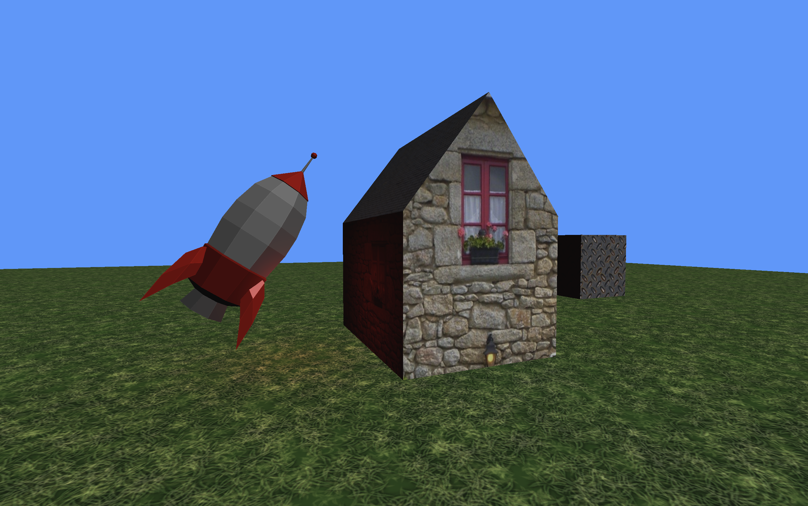
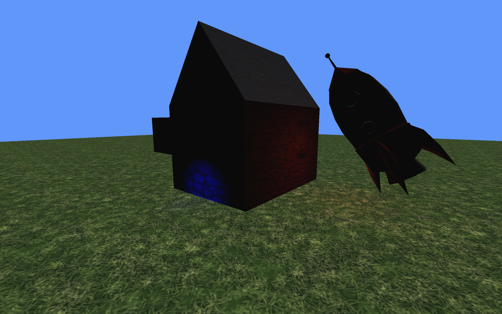
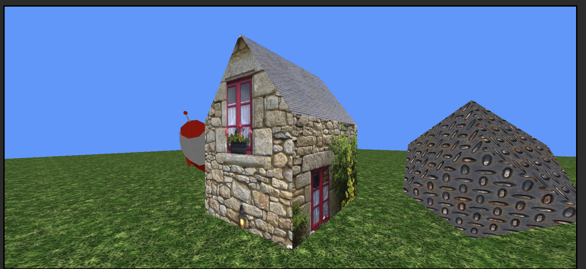
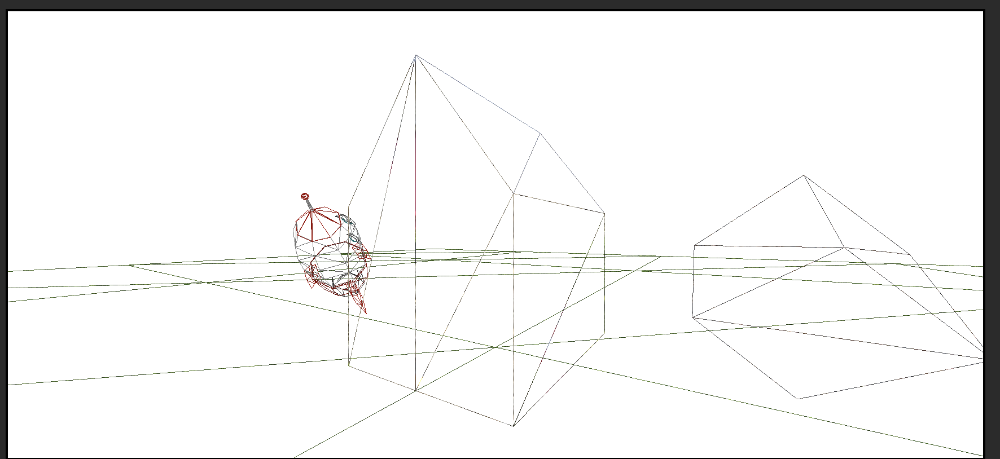
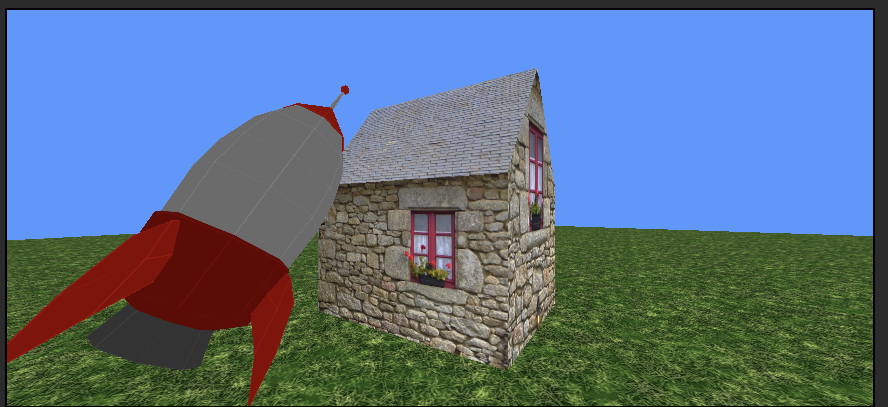
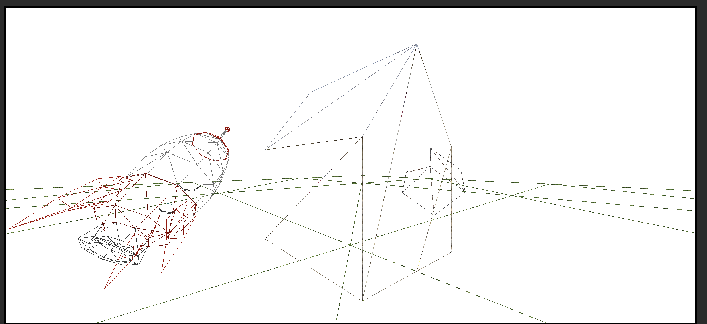
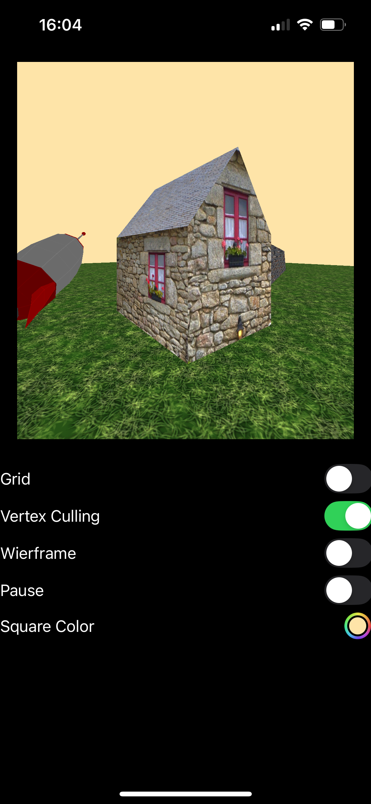
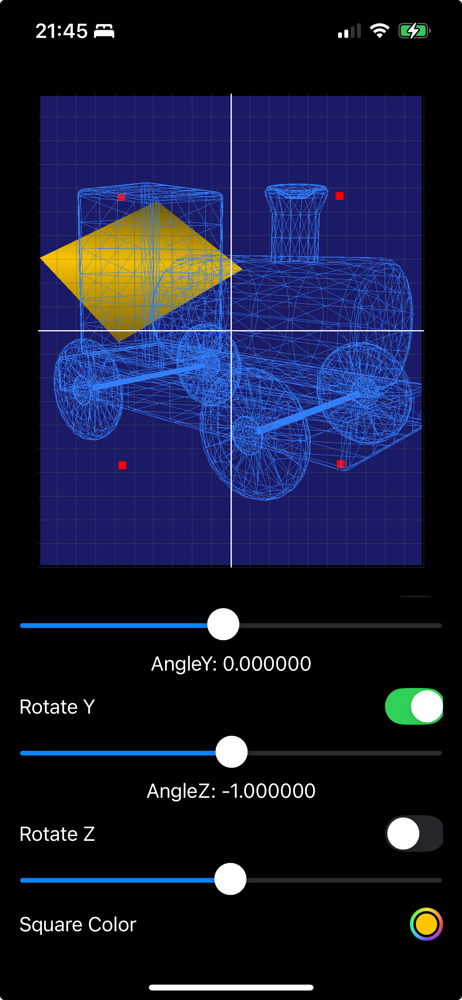
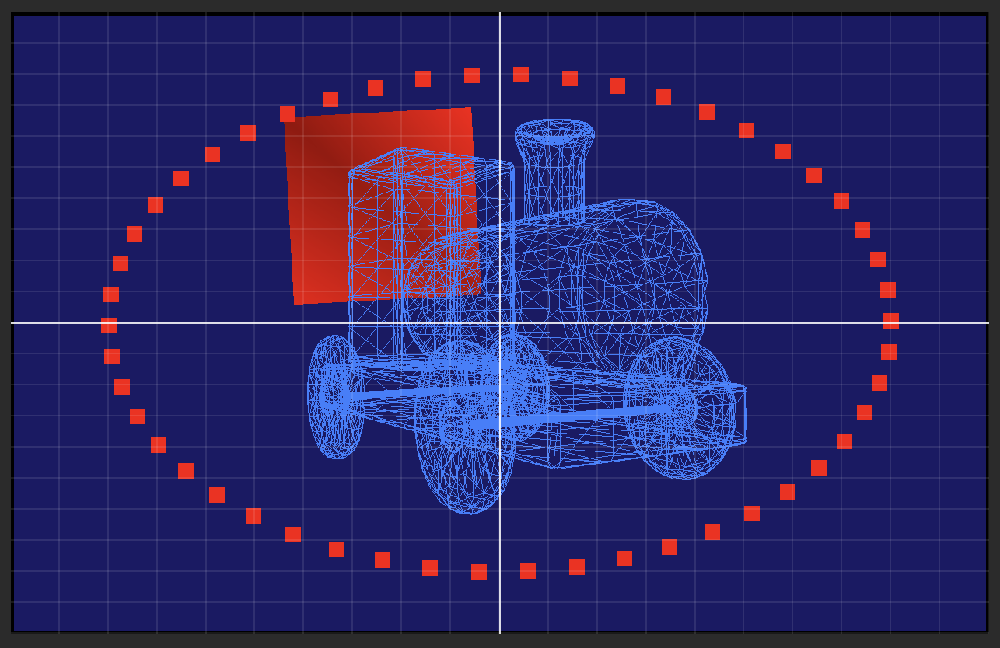

# Metal Sand Box

MetalSandBox is a Metal-based application designed as a learning platform for Metal graphics rendering on Apple platforms. This project serves as a practical implementation of concepts from the book ["Metal by Tutorials"](https://www.kodeco.com/books/metal-by-tutorials/v4.0) by Caroline Begbie, Tim Oliver, and Marius Horga.


## Demo's Features

- Render a 3D rocket model, a low-poly house and a 1x1 box
- The scene is rotating on the Y-axis by matrix transformations.
- Toggleable grid display.


## Screenshots

### Here view from the left of the scene
Some lighting added to the scene.



Here we can see a sun, a point light (red), and a spotlight (blue).




### Show the scene in wireframe mode, with the culling of triangles (Before lighting works)




Same view, in wireframe mode, showing the culled triangles, optimized by the Metal API.

### Here view from the right of the scene


Again, the same view, in wireframe mode, showing the culled triangles, optimized by the Metal API.



### Same but iPhone version



### Older versions



We can see the usage of rotation, translation, and scaling in the Metal shaders.
The train is a mesh took from a USDZ file, at the back a square and some points, which the shader is above.
The train is rotated around the center, and the slider controls the rotation.
It is rotated around the bottom-left corner.



The train is a mesh took from a USDZ file, at the back a square and some points, which the shader is above.


## Project Structure

```sh
MultiTests
├── MultiTests.entitlements
├── MultiTestsApp.swift
├── Game
│   ├── Camera.swift
│   ├── GameScene.swift
│   ├── Renderer.swift
│   ├── Rendering.swift
│   └── SceneLightning.swift
├── Geometry
│   ├── Mesh.swift
│   ├── Model.swift
│   ├── Primitive.swift
│   ├── Submesh.swift
│   ├── Transform.swift
│   └── VertexDescriptor.swift
├── Input
│   ├── InputController.swift
│   └── Movement.swift
├── Models
│   └── * Some usdz files
├── Shaders
│   ├── Common.h
│   ├── Fragment.metal
│   ├── Lighting.h
│   ├── Lighting.metal
│   ├── ShaderDefs.h
│   └── Vertex.metal
├── SwiftUI Views
│   ├── ContentView.swift
│   └── MetalView.swift
├── Textures
│   ├── TextureController.swift
│   └── Textures.xcassets
│       ├── Contents.json
│       ├── grass.textureset
│       └── steel.textureset
└── Utility
    └── MathLibrary.swift
```
